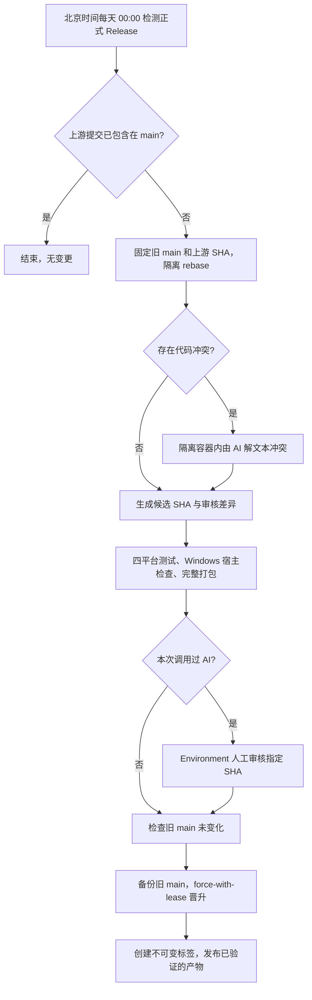

# 官方 Release 自动同步与发布

目标：定时检测 `moesnow/March7thAssistant` 的正式 Release，将桌面分身等 fork 提交
rebase 到新版上游；测试和打包通过后自动发布。只要调用过 AI 解冲突，就必须先人工审核。
全部运行在 GitHub Actions，无需服务器，也不新增 Python 脚本。MirrorChyan 的现有行为保持不变。

## 工作流程



任何失败都会阻止后续晋升。AI 失败不会进入自动发布；等待审核时 main 的新提交也不会被覆盖。
定时入口默认关闭，必须设置 `UPSTREAM_SYNC_ENABLED=true` 才会开始自动同步。

## 1. 补充 App 权限

沿用已经配置好的 `BOT_APP_CLIENT_ID`、`BOT_APP_PRIVATE_KEY`、`AI_BASE_URL`、
`AI_MODEL_ID`、`AI_API_FORMAT` 和 `AI_API_KEY`。

打开 <https://github.com/settings/apps/fluoxue-m7a-bot/permissions>：

- 保留现有 Contents、Issues、Pull requests 的 Read and write。
- 将 **Workflows 设为 Read and write**（有的页面只显示 Read/write）。
- 若 Key 放在 Variables，仍需要 Variables: Read-only。
- 保存后，到 <https://github.com/settings/installations> 接受安装权限更新。

原因：rebase 会重写包含 `.github/workflows` 的提交，推送候选和晋升 main 都需要
Workflows 写权限。普通 `/m7a` 机器人的安装令牌已改为显式申请较小的权限集，
不会因为 App 新增这个权限而获得 Workflows 写权限。

此方案的普通 Issue 机器人与同步控制器共用 App 身份；令牌分开限权，**并不等于两个独立身份**。
当前 main 未受保护时可直接使用。若以后为 main 配置 ruleset 并为发布者添加 bypass，
应改用单独的发布 App，避免同一个 bypass 身份同时用于通用机器人。
工作流不会自行修改分支保护。

## 2. 配置 AI 人工审核

在仓库 **Settings → Environments → New environment** 创建：

```text
upstream-ai-review
```

进入该 Environment：

1. 启用 **Required reviewers**，添加 `FLuoXue`。
2. 只有你一个维护者时，不要勾选 Prevent self-review，否则你手动启动的同步无法由自己批准。
3. 保存。若设置部署分支限制，允许 `main`；工作流从 main 启动，候选 SHA 在审核链接中。

环境名存在还不够，必须有非空的 Required reviewers。工作流在调用 AI 前和晋升前都会检查，
不会把一个无保护的同名 Environment 当作人工审批。

审核时打开该 Actions 运行：

- 查看 Summary 中的上游 SHA、旧 main SHA、候选 SHA 和 AI 参与标记。
- 下载 `upstream-review-<attempt>`：`changes.diff` 是旧 main 到候选的完整差异，
  `range-diff.txt` 展示 fork 补丁在 rebase 前后的变化，`candidate.json` 记录本次固定参数。
- 查看 AI 步骤日志中的冲突处理说明，以及全部测试、构建结果。
- 确认可接受后，通过 **Review deployments → upstream-ai-review → Approve and deploy**。

审批针对同一次运行的固定候选 SHA。需要修改候选时，应重新准备和验证；不要合并候选分支到 main。
这里是 rebase 历史晋升，普通 Merge / Squash PR 不能替代它。

## 3. 先检查，再演练

代码提交到 main 后，打开 **Actions → Sync upstream release → Run workflow**，Branch 选 main。

| mode | publish | 行为 |
| --- | --- | --- |
| `check` | 任意 | 检测官方版本和 App 安装权限；不调用 AI、不推送、不发布 |
| `rehearse` | 任意 | 创建一个本地模拟上游提交，rebase 并推送测试候选，运行完整测试和打包；永不更新 main 或发布 |
| `rehearse-ai` | 任意 | 在模拟上游与 fork 中加入相互冲突的文档注释，真实调用 AI 解冲突并验证；永不更新 main 或发布 |
| `sync` | 不勾选 | 准备真实新版候选，必要时调用 AI，测试并打包；不更新 main 或发布 |
| `sync` | 勾选 | 真实同步，测试/构建通过后自动晋升；调用过 AI 时先等人工审核 |

先运行 `check`。当前官方最新为 `v2026.9.30`，已包含在 fork 中时会显示无需同步，这是正常结果。
随后运行 `rehearse`。它使用 `v2099.1.1.post1` 模拟版本，产物仅供验证流水线，**不要安装或发布此测试包**。
`rehearse` 验证无 AI 路径；`rehearse-ai` 验证容器内的真实 AI 冲突处理，会消耗少量模型额度。
后者在 `assets/docs/Background.md` 加入仅存在于演练候选的文档注释，不修改真实 main。

演练通过后，在 **Settings → Secrets and variables → Actions → Variables** 新建：

```text
UPSTREAM_SYNC_ENABLED=true
```

之后在北京时间每天 00:00 检测一次（GitHub cron 使用 UTC，对应 `0 16 * * *`）。
GitHub 定时任务可能延迟；公开仓库长期无活动时也可能被 GitHub 暂停。
设置 `false` 会停止后续定时同步，正在运行的任务需在 Actions 页面手动取消。
`BOT_ENABLED` 只控制通用 `/m7a` 评论入口，两个开关独立。

## 版本与冲突策略

`.github/upstream-sync.json` 保存上次纳入的官方 SHA。初始基线为 fork 开发桌面分身前的
`23e4d7af79fca758cdb98a2e9e7ff03c6011bcef`，包含官方 `v2026.9.30` 和随后一次子模块更新。
后续只重放这个基线之后的 fork 提交，不把旧版上游提交当作定制补丁重放。
上游历史分叉、回退或同名版本被移动时停止，要求人工检查基线。

fork 使用递增的 `.postN` 版本，例如官方 `v2026.10.2` → fork `v2026.10.2.post1`。
若当前 fork 版本更高，则在较高版本上增加 post 序号，避免客户端判断成降级。
每次生成与标签一致的 `assets/config/version.txt` 和更新日志标题。

部分冲突不需要 AI：版本号最终统一生成；更新日志按三方比较合并独立段落，双方同时修改
同一段时才停下来；`.mo` 文件从最终 `.po` 重新编译，繁体文档由最终简体内容重新生成。
这些确定性操作仍走无 AI 路径。

AI 使用固定版本 OpenCode 容器，每次最多 5 分钟、每个 rebase 最多 3 次调用。
Agent 只能访问文件副本和模型 Key，不持有 GitHub 写令牌或 `.git`。
控制器只取回本轮列出的冲突文件；工作流、同步配置和 MirrorChyan 冲突需要人工处理。
第一版只接受普通文本的 modify/modify 冲突；二进制、删除/修改、重命名等复杂情况停止并保留诊断。
AI 不负责提交、推送、标签或发布；其任何参与都会使人工审核标记保持为 true。

## 发布、重试与恢复

测试复用 `8.test.yml` 的四平台矩阵，包含 Python 测试、翻译校验和 Windows 原生宿主自检。
打包统一由 `13.package.yml` 生成完整 ZIP、完整 7z 和 update.7z，附带 SHA、标签和校验和。
发布 job 在独立 runner 上执行，只使用原始可信控制器和已构建产物，不运行候选项目代码。

晋升前先保存 `backup/upstream-<旧 main SHA>`，再执行：

```text
git push --force-with-lease=refs/heads/main:<旧 SHA> origin <候选 SHA>:refs/heads/main
```

主分支在等待测试/审核期间变动时，必须重新运行同步。现有每日子模块更新仍可正常运行，
它与同步竞争时也由这个 lease 拦截；不会无条件强推。

标签通过本次 `GITHUB_TOKEN` 创建，不会再次触发旧的标签构建工作流。
发布先创建草稿，全部产物上传成功后才公开；已经公开的同名 Release 不会被覆盖。
旧的手动标签发布入口仍可用，它也复用统一打包流程。MirrorChyan 条件和功能未修改。

如果晋升已成功、上传失败，优先对原运行选择 **Re-run failed jobs**，使用原候选及原构建产物重试。
已存在且指向相同候选的标签保持不变；指向其他对象的同名标签会导致任务失败。
不要通过修改已发布标签来重试。Artifact 默认保留 30 天，过期后需要人工恢复发布。

成功后候选分支和备份分支保留供检查，不自动删除；积累较多时可手动清理确认不再需要的分支。
确需回退 main 时，先核对当前 SHA，再以它作为 lease，恢复备份 SHA；已发布标签仍保持不变。

## 实现与本地验证

- `12.upstream_sync.yml`：触发、权限、AI 隔离、测试/构建依赖、审批和发布。
- `.github/scripts/upstream-sync.cjs`：版本检测、Git 操作、冲突处理、产物校验及发布。
- `.github/scripts/upstream-sync.test.cjs`：临时 Git 仓库上的真实 rebase、竞态和重试测试。
- `13.package.yml`：可复用的无写权限打包任务。

```text
node --test .github/scripts/upstream-sync.test.cjs
```

测试只操作专门创建的临时仓库，不修改工作仓库的 main 或标签。
